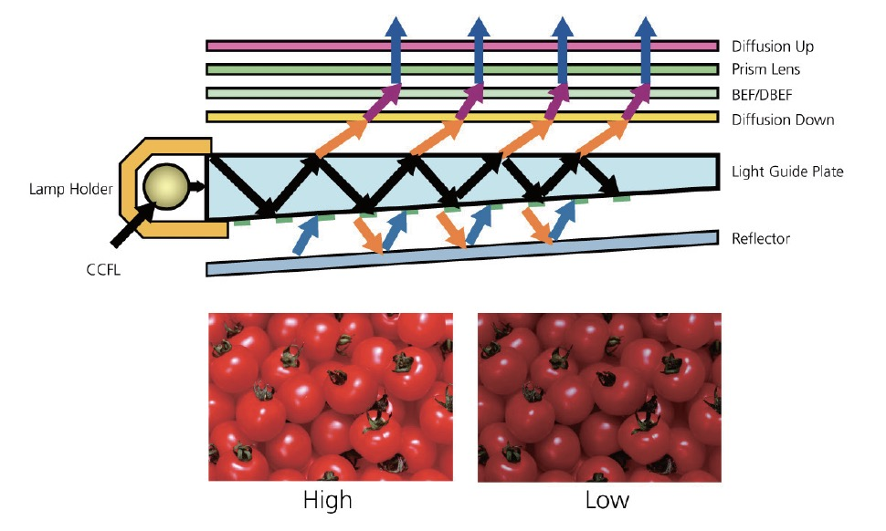

# 高折光率树脂

## 产品介绍 PRODUCT INTRODUCTION

高折光率树脂是一种以有机-无机杂化高分子为核心材料，含有可用紫外光/热固化的功能基团的复合材料产品。
本产品的折光率高，光学透明性好，可被UV光线瞬间固化成型。
本产品不含任何卤素元素，不含有机溶剂以及其他常见的对人有毒，对环境有害的成分。

## 主要技术指标 TECHNICAL SPECIFICATIONS

| 性质/指标 | 描述 |
| :--- | :--- |
| 外观 | 无色透明粘稠液体 |
| 颜色 | (Gardner) <= 2 (最大值) |
| 气味 | 有轻微的类酯的气味 |
| 密度 | ~1.18 g/cm^3 (样品测试温度: 23±2℃) |
| 粘度 | ~3,800 mPa·s (样品测试温度: 23±2℃) |
| 折光率 | nD20 = 1.64 |
| UV活性固含量 | >= 98% |
| 可燃性 | 不易燃 |
| 酸碱性 | PH = 6±1 |

UV固化后的性质也取决于客户的产品配方中的其他组分的选择，例如另加的单体、低聚体、以及光引发剂的类型、组合及其比例。

## 产品优势 PRODUCT ADVANTAGES

与同类产品相比，本产品的折光率高，光学透明性高，与有机单体及树脂的相容性好，化学稳定性高，可被UV光线瞬间固化，对环境友好。

## 产品应用 PRODUCT APPLICATIONS

可作为核心成分制备各种高折光系数材料，应用于各种光学镜头，光通讯器件，光电子器件，电子显示屏，LED发光原件封装，OLED器件折光系数匹配等等；

可应用于需要快速固化、无化学污染、高折光材料的其他领域光学产品。
