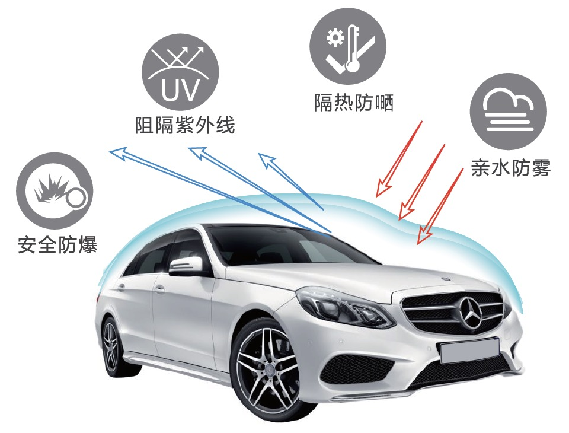

# 多能态纳米复合材料

## 产品介绍 PRODUCT INTRODUCTION

多能态纳米复合材料是本公司基于独有的“有机-无机杂化高分子复合材料”技术平台，自主研发的一款集亲水防雾、抗霜功能、阻隔热能辐射以及紫外线隔阻等多种功能为一体的多能态材料。本产品可以涂覆在PET、PVC、PU、PC膜，有机玻璃、玻璃等各种透明基材上，并且在紫外光照射下，可在数秒钟内完全固化，形成均匀透明的浅蓝色涂膜，紧密地附着在基材上。

## 主要技术指标 TECHNICAL SPECIFICATIONS

| 性质/指标 | 描述 |
| :--- | :--- |
| 外观 | 蓝色，低粘度液体 |
| 密度 | ~1.10 g/cm^3 (样品测试温度: 23±2℃) |
| 粘度 | 20-80 mPa·s (样品测试温度: 23±2℃) |
| UV活性固含量 | >= 65% |
| 可燃性 | 不可燃 |
| 酸碱性 | PH = 6±1 |

## 产品优势 PRODUCT ADVANTAGES

由本材料产品制备并经紫外线固化后的涂层或薄膜既具有长久高效的防雾能力及抗结霜能力，也具有良好的热阻隔能力，及一定的紫外线阻隔能力，同时，还具有耐擦洗，耐高温，耐低温等优点。

在温度剧烈变化(从-25℃到+70℃)，湿度>=90%RH的条件下，涂层或薄膜的表面不仅不会出现人们常见的凝雾现象，而且能延缓附在涂层或膜层表层上的水结霜或结冰时间，大大减少结霜的状况发生，从而能保证应用区域的高光学透明性及高清晰度。

## 产品应用 PRODUCT APPLICATIONS

可广泛地应用于太阳能电池、汽车车窗、飞机机窗、高铁机车的车窗、太阳房玻璃顶、建筑玻璃、眼镜、各种头盔镜片等市场领域。
