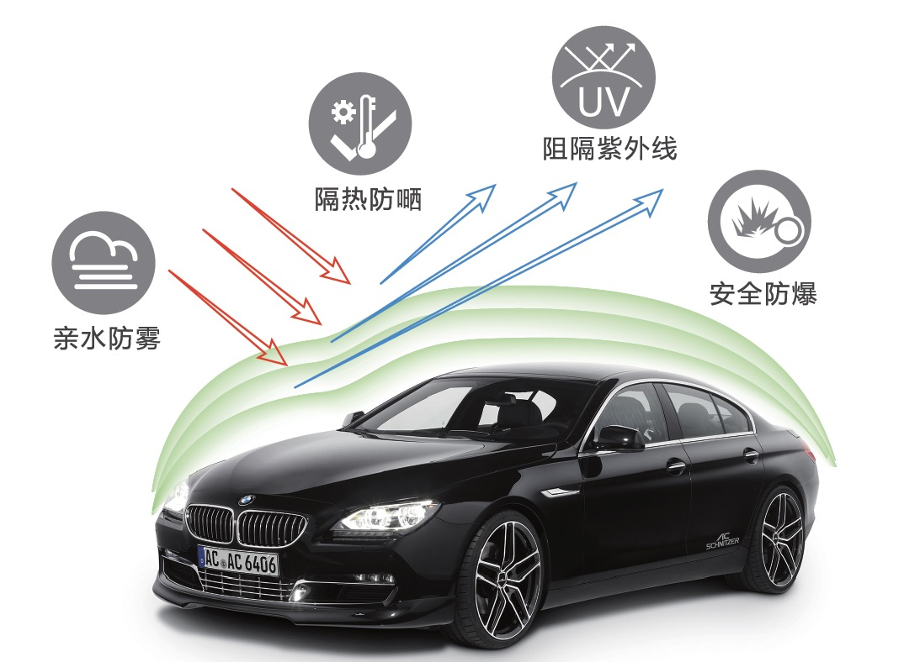
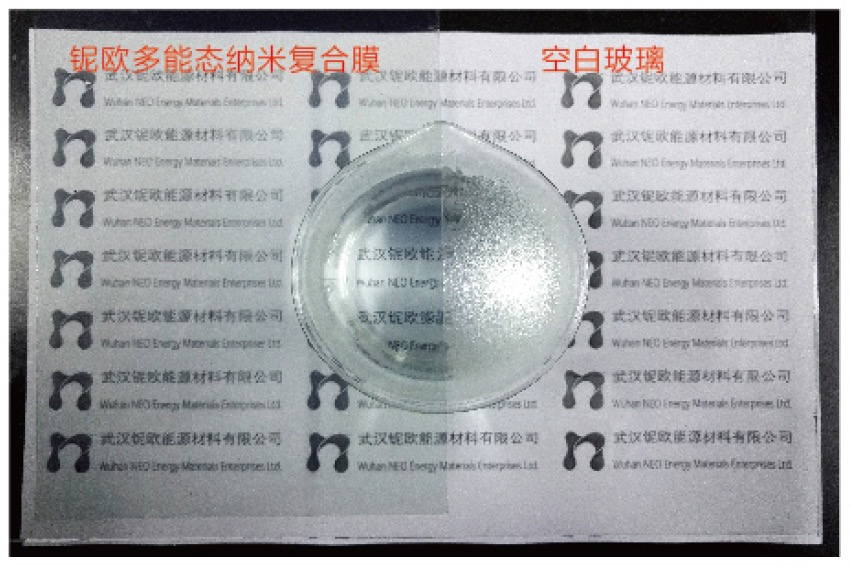
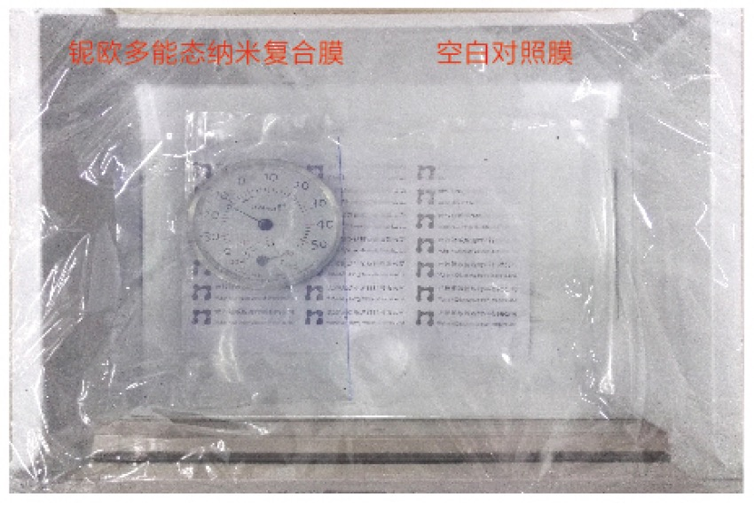

# 多能态纳米复合膜

## 产品介绍 PRODUCT INTRODUCTION

多能态纳米复合膜是本公司多能态纳米复合材料在PET膜上的应用成果。本产品采用高清光学基材膜，是一款集防雾、抗结霜、隔热、隔紫外线、防爆等多重功能于一体的市场新产品。

## 主要技术指标 TECHNICAL SPECIFICATIONS

| 性质/指标 | MFN-60F | MFN-60S |
| :--- | :---: | :---: |
| 外观 | 淡蓝色透明薄膜 | 深黑色透明薄膜 |
| 可见光透过率 | 80% | 28% |
| 红外线阻隔率 | 72% | 94% |
| 紫外线阻隔率 | 55% | 90% |
| 太阳能总阻隔率 | 42% | 81% |

| 性质/指标 | 描述 |
| :--- | :--- |
| 接触角(水) | 12° |
| 防雾性能 | 70℃, 90%RH条件下，100%不起雾 |
| 抗结霜性能 | 有效对抗结霜，延缓水结霜的时间，并加快霜融化的速度 |
| 功能层附着力 | 0 级 |
| 耐干布擦拭性能 | >2,000 次(500g 压力) |
| 耐水擦拭性能 | >200 次(500g 压力) |
| 耐清洁液擦拭性能 | >10,000 次(500g 压力) |
| 耐乙醇擦拭性能 | >200 次(500g 压力) |
| 耐水性能 | 在沸水中连续煮8小时以上，仍具防雾性能 在常温水中连续浸泡5天，仍具防雾性能 |
| 适用温度 | -30 - 100℃ |
| 耐候性能 | 3 年 |

> 在多次擦洗后，仍保持有效防雾功能。

## 产品优势 PRODUCT ADVANTAGES
本产品采用创新的技术，将多种功能材料科学配方，具有持久耐用的亲水防雾及抗结霜功能，较好的红外阻隔效果，超强的隔热性能，同时隔紫外线等优点。绿色节能，低碳环保。

## 实际隔热效能比较 PERFORMANCE COMPARISON WITH COMPETITIVE PRODUCTS

通过模拟实验，重现太阳光透过车窗使车内温度升高的现象，检测多能态纳米复合膜的隔热效果。

具体实验方法：
在室温20℃的条件下，将一块空白玻璃(模拟车窗)隔挡在一组位置固定的红外灯(模拟太阳光)与温度探测器(模拟车内环境)的中间。
开启红外灯照射1分钟，检测温度升高的度数T1；
再在玻璃上贴上多能态纳米复合膜，或其他品牌的太阳膜，以相同的方式检测温度升高的度数Tx；
由于膜有隔热功能，贴膜后，升高的温度Tx将小于T1，并且其差值(T1-Tx)越大，说明膜的隔热效果越好。

| 品牌 | 类型 | 紫外线 阻隔率(%) | 红外光 阻隔率(%) | 可见光 透过率(%) | 太阳能 总阻隔率(%) | 温度升高 Tx/℃ | 与空白玻璃 的温差表达 隔热效果/℃ |
| :--- | :--- | :---: | :---: | :---: | :---: | ---: | ---: |
| 武汉铌欧 | 空白玻璃 | 16-17 | 27 | 89 | 17-18 | 12.2 | 0.0 |
| 武汉铌欧 | MFN-60F (前挡) | 53-55 | 72-73 | 79-80 | 42-43 | 3.6 | 8.6 |
| 武汉铌欧 | MFN-60S (侧后挡) | 89-91 | 94-95 | 28-29 | 81-82 | 1.5 | 10.7 |
| 国内某品牌 | 前挡 | 99.7 | 32-40 | 77-79 | 30-33 | 6.5 | 5.7 |
| 国内某品牌 | 侧后挡 | 99.9 | 43-51 | 16 | 69-72 | 6.2 | 6.0 |
| 美国品牌A | 前挡 | 99.8 | 23-28 | 74-75 | 28-30 | 9.0 | 3.2 |
| 美国品牌A | 侧后挡 | 100 | 42-47 | 24 | 64-66 | 6.0 | 6.2 |
| 美国品牌B | 前挡 | 96.4 | 21-24 | 72 | 28-29 | 9.0 | 3.2 |
| 美国品牌B | 侧后挡 | 98.3 | 21-28 | 23-24 | 56-59 | 8.7 | 3.5 |

隔热效能比较结果表明，铌欧多能态纳米复合膜MFN-60F和MFN-60S除具有额外的、独特的防雾性能外，在保持相近或略优的可见光透光度的同时，还具有明显优越的隔热功能。

## 实验对比 EXPERIMENTAL CONTRAST

如上图，将半边贴有多能态纳米复合膜的玻璃扣放在盛有70℃热水的水杯杯口，可见未贴多能态纳米复合膜的部分全部起雾，而贴有多能态纳米复合膜的部分完全没有起雾。

如上图，左半边为多能态纳米复合膜，右半边为普通薄膜。经过在-20℃, 90%RH环境中冷冻24h后，普通薄膜表面超过一半面积已结霜，而多能态纳米复合膜表面完全未结霜。

## 产品应用 PRODUCT APPLICATIONS
可广泛地应用于汽车车窗、飞机机窗、高铁机车的车窗、太阳能电池等市场领域。
