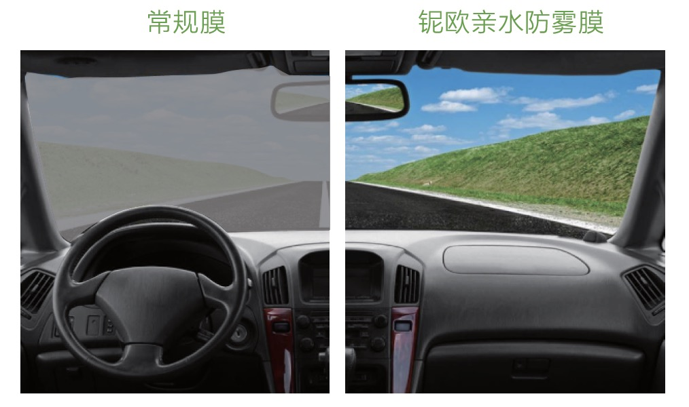
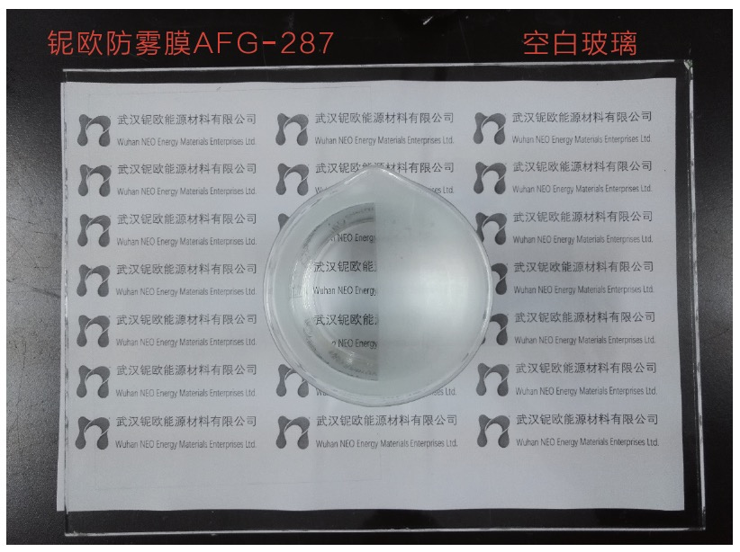
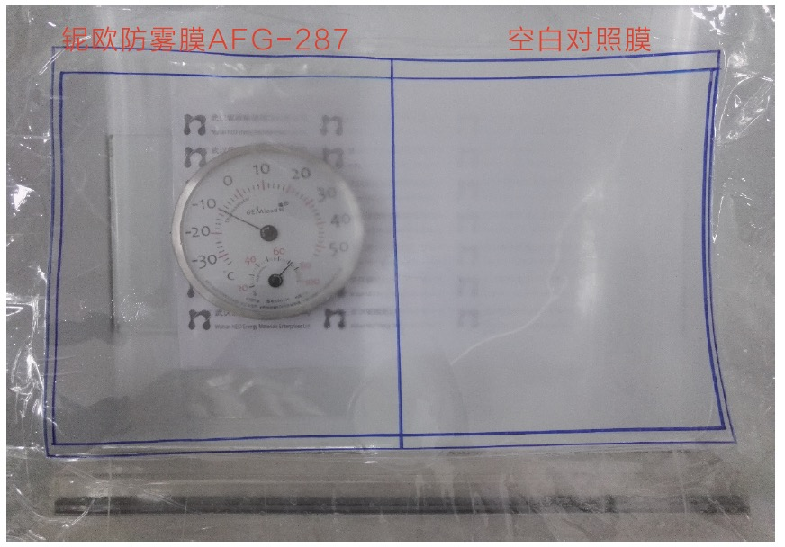

---
description:
产品编号：SPW-0125
专利号：申请中
---

# 长效亲水防雾膜 SPW-0125

## 产品介绍 PRODUCT INTRODUCTION

长效亲水防雾膜SPW-0125 是利用本公司自主研发的超亲水材料，在透明基材PET薄膜上涂覆，经UV光照瞬间固化，并配以安装胶及正反面保护膜而成，是本公司超亲水材料的应用产品。

## 主要技术指标 TECHNICAL SPECIFICATIONS

| 性质/指标 | 描述 |
| :--- | :--- |
| 外观 | 无色透明膜 |
| 可见光透过率 | > 90% |
| 防雾性能 | 70℃, 90%RH条件下，100%不起雾 |
| 抗结霜性能 | 有效对抗结霜，延缓水结霜的时间，并加快霜融化的速度 |
| 接触角(水) | 12° |
| 功能层附着力 | 0 级 |
| 耐干布擦拭性能 | >2,000 次(500g 压力) |
| 耐水擦拭性能 | >200 次(500g 压力) |
| 耐清洁液擦拭性能 | >10,000 次(500g 压力) |
| 耐乙醇擦拭性能 | >200 次(500g 压力) |
| 耐水性能 | 在沸水中连续煮8小时以上，仍具防雾性能 在常温水中连续浸泡5天，仍具防雾性能 |
| 适用温度 | -60 - 100℃ |
| 耐候性能 | 3 年 |

> 产品膜的透光率主要取决于PET基材膜的透光率，防雾功能层的透光率 >99%，
> 在多次擦洗后，仍保持有效防雾功能。

## 产品优势 PRODUCT ADVANTAGES

长效亲水防雾膜AFG-287具有超亲水性能，可以使水的珠滴迅速在涂膜表面铺展开来，形成均匀超薄水膜。本产品在温度剧烈变化(从-25℃到+70℃)，湿度>=90%RH的条件下，涂层或薄膜的表面仍不会出现人们常见的凝雾现象，而且能延缓附在涂膜表层上的水结霜或结冰的时间，大大减少结霜的状况发生，从而能保证应用区域的高光学透明性及高清晰度。本产品具有高度耐擦洗性(干擦，水擦，清洁液擦等)，是一款具有长效防雾性能的优秀产品。

## 实验对比 EXPERIMENTAL CONTRAST

如上图，将半边贴有防雾膜AFG-287的玻璃扣放在盛有70℃热水的水杯杯口，可见未贴防雾膜的部分全部起雾，而贴有防雾膜的部分完全没有起雾。

如上图，左半边为防雾膜AFG-287，右半边为普通薄膜。经过在-20℃, 90%RH环境中冷冻24h后，普通薄膜表面完全结霜，而防雾膜表面大部分面积未结霜。

## 产品应用 PRODUCT APPLICATIONS

可广泛地应用于汽车车窗、飞机机窗、高铁机车的车窗、光学镜头、仪表表盘、眼镜、各种头盔镜片、浴室镜、冰柜/酒柜等市场领域。
