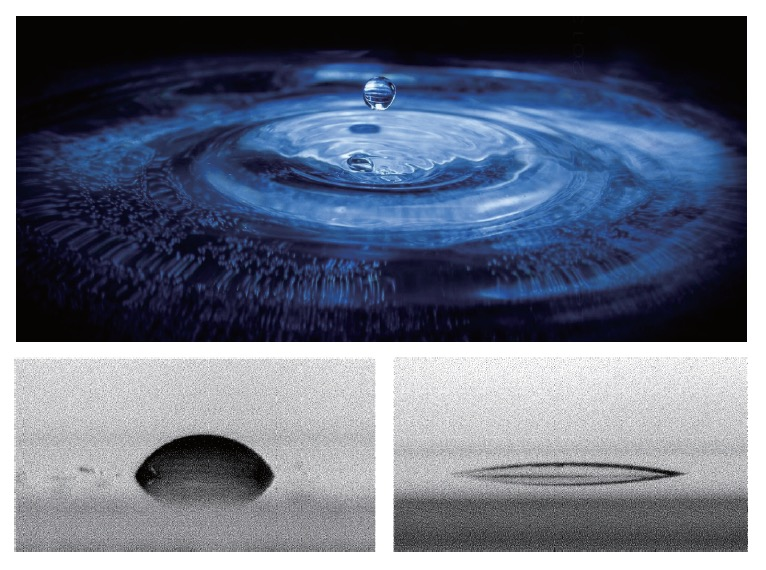

# 紫外固化超亲水材料

## 产品介绍 PRODUCT INTRODUCTION

紫外固化超亲水材料是基于本公司的“有机-无机杂化高分子复合材料”技术平台，自主研发的一种功能材料产品。

本产品可以涂覆在诸如PET、PVC、PU、PC膜、有机玻璃及玻璃等各种透明基材上，并在紫外光照射下，在数秒钟内完全固化，形成透明的涂膜，紧密地附着在基材上。

固化后的涂层或薄膜具有超亲水性，水珠滴在其表面，能否迅速延展铺平，水接触角在5°左右。

## 主要技术指标 TECHNICAL SPECIFICATIONS

| 性质/指标 | 描述 |
| :--- | :--- |
| 外观 | 无色，透明低粘度液体 |
| 密度 | ~1.0 g/cm^3 (样品测试温度: 23±2℃) |
| 粘度 | 20-80 mPa·s (样品测试温度: 23±2℃) |
| UV活性固含量 | >= 50% |
| 可燃性 | 不可燃 |
| 酸碱性 | PH = 6±1 |

## 产品优势 PRODUCT ADVANTAGES

本产品可固化形成高透光性的超亲水涂层或薄膜，与同类产品相比，该薄膜具有亲水性持久，对水、清洁剂及酒精等的耐擦洗性好，耐高温，耐低温等优点。

本产品制备的超亲水涂层或薄膜可实现防雾、抗结霜的功能，在温度剧烈变化(从-25℃到+70℃)，空气湿度>=90%RH的条件下，超亲水涂层的表面不仅不会出现人们常见的凝雾现象，而且能延缓附在涂层或膜层表面上的水结霜或结冰时间，大大减少结霜的状况发生，从而能保证应用区域的高光学透明性及高清晰度。

## 产品应用 PRODUCT APPLICATIONS

该产品可广泛地应用于汽车车窗、飞机机窗、高铁机车的车窗、冰柜/酒柜玻璃、光学镜头、仪表表盘、眼镜、各种头盔镜片、浴室镜、医疗器械、生物工程材料、食品包装等市场领域。
