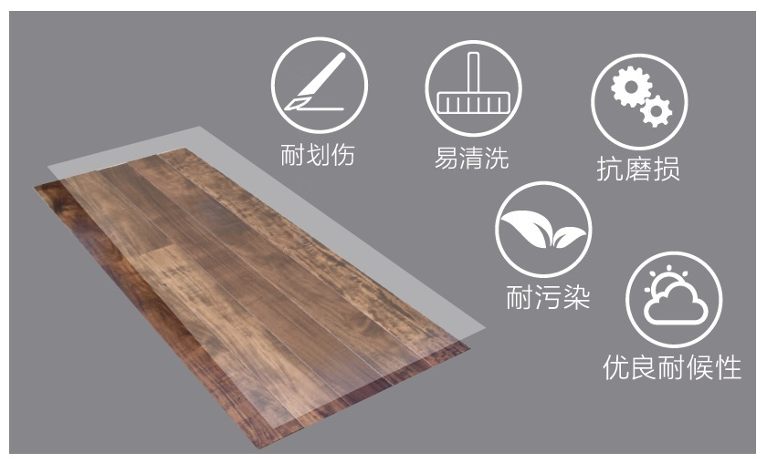

# 紫外固化特种高机械强度材料

## 产品介绍 PRODUCT INTRODUCTION

本产品是以具有知识产权的有机-无机杂化材料为核心成分，可被UV光瞬间固化的液态材料。本产品固化后，涂层表面平滑、细腻，手感舒适，具有卓越的抗磨损、耐划伤、耐污染、抗腐蚀同时容易清洗等特性，不仅大大地延长所保护产品的使用寿命，更大幅地降低后期维护费用，是商业建筑或高端产品的理想用料。

## 主要技术指标 TECHNICAL SPECIFICATIONS

| 性质/指标 | 描述 |
| :--- | :--- |
| 外观 | 灰白色，半透明粘稠液体 |
| 气味 | 有轻微的类酯的气味 |
| 密度 | ~1.10 g/cm^3 (样品测试温度: 23±2℃) |
| 粘度 | 1400-2700 mPa·s (样品测试温度: 23±2℃) |
| 表面硬度 | 2H - 9H (可根据需要调整) |
| 附着力 | 0-1 级 |
| 耐磨度 | P-180 / < 0.10-0.06 (S33 / < 0.04-0.025) |
| 耐划伤 | 钢丝团负荷1000g，来回刮擦>6,000次无任何刮痕 |
| 表面光泽度 | >= 80 也可根据需要调低 |
| 耐污染 | 抗各种饮料，葡萄酒，酱油，染料等油性或水性污染 |
| 耐水性 | 常温浸泡72小时无变化 |
| UV活性固含量 | >= 98% |
| 可燃性 | 不易燃 |
| 酸碱性 | PH = 6±1 |

## 产品优势 PRODUCT ADVANTAGES

本产品具有高透明度，耐划伤性高，耐磨性好，耐气候，耐油污，耐水，易于清洁，阻燃效果强，抗酸碱腐蚀能力强等优良性能。

固化速度快，零VOC，不含重金属及其他在传统材料中常见的有毒有害物质，是一种环境友好型材料。

可用UVLED快速固化，从而可以应用于UVLED系列涂料中。

## 产品应用 PRODUCT APPLICATIONS

可应用于地板漆、家具漆：透明，耐划伤，耐磨损，耐污；
可应用于外墙涂料：耐气候，耐黄变；
可应用于贵重石材涂料：耐划伤，高光泽度，耐水。
