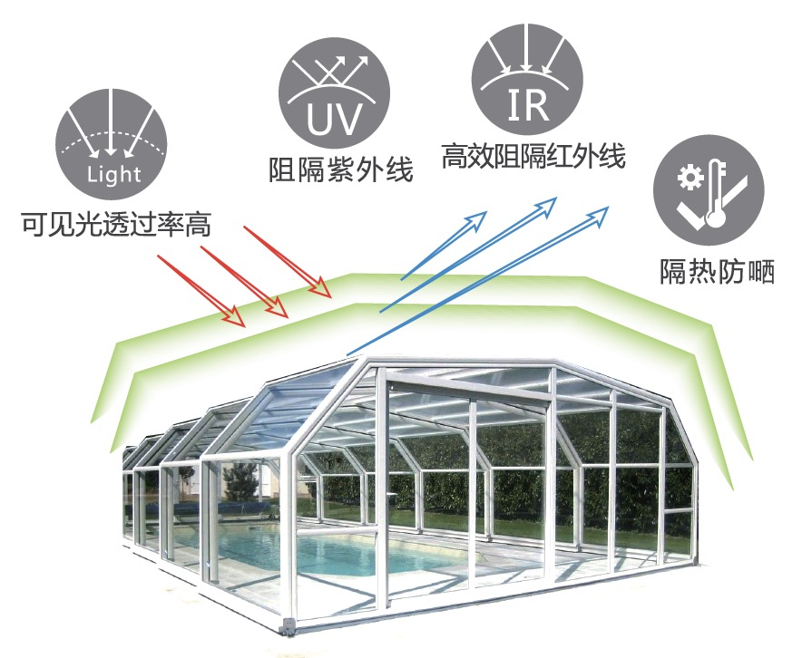

# 高效热能阻隔透明材料

## 产品介绍 PRODUCT INTRODUCTION

高效热能阻隔透明材料是一种对热能有高效阻隔作用的，蓝色透明的，液态有机-无机杂化纳米复合材料。

本产品可以涂覆在玻璃、塑料等不同基材表面，采用光固化技术，在规定波长的紫外光照射下，液态材料瞬间固化，形成固态薄膜。该薄膜对全红外光谱，尤其是中近红外有高度阻隔功能，且在可见光波段有高透明度。

薄膜的厚度可根据不同用途，由涂装工艺控制在2~30µm范围内，膜的红外阻隔率保持在70%-95%之间，可见光透过率在70%-90%之间。

## 主要技术指标 TECHNICAL SPECIFICATIONS

| 性质/指标 | 描述 |
| :--- | :--- |
| 外观 | 深蓝色，半透明，低粘度液体 |
| 气味 | 有轻微的类酯的气味 |
| 密度 | ~1.20 g/cm^3 (样品测试温度：23±2℃) |
| 粘度 | 30-80 mPa·s (样品测试温度：23±2℃) |
| UV活性固含量 | >= 70% |
| 可燃性 | 不易燃 |
| 酸碱性 | PH = 6±1 |

## 产品优势 PRODUCT ADVANTAGES

本产品可被UV光线瞬间固化，高度节能，对环境友好。

在隔热工程应用领域中，由本材料产品经光固化制备的涂层或薄膜，对太阳光谱中的红外波段，尤其是中近红外波段的辐射，有高度的阻挡效能，呈现出有效的热阻隔效应。
同时，该涂层或薄膜对可见光高度透明，且具有良好的耐划伤，耐磨损，耐气候，耐水，耐化学腐蚀等优良性能。

本产品是对当前隔热工程市场上的LOW-E产品的良好补充或替代，且具有起始投资小，生产工艺简单可靠，产品成本低等特点。

## 产品应用 PRODUCT APPLICATIONS

主要应用于建筑玻璃、太阳房、天窗玻璃、玻璃幕墙、汽车侧挡，农业大棚等既有隔热需求又要求透明的应用领域。
