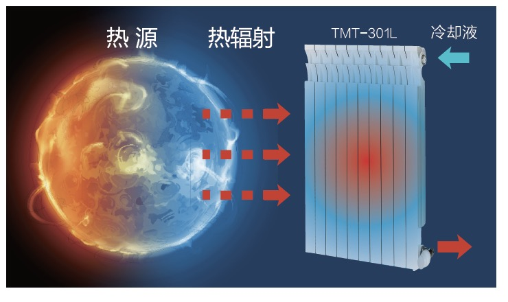

# 非接触式热能转移材料

## 产品介绍 PRODUCT INTRODUCTION

非接触式热能转移材料是本公司在独有的分子杂化技术平台上自主研发的一种能够高效吸收热辐射的有机-无机杂化纳米复合材料。

本产品可涂布在铜、铝、铁、合金等多种介质表面，采用光固化技术，在规定波长的紫外光照射下，液态材料瞬间固化，形成固态薄膜。
该薄膜对全红外光谱，尤其中近红外范围的热辐射有高度吸收和收集的特种功能。

在散热工程应用领域里，有别于传统的利用热对流或接触式热传导的散热机制，本产品通过有效吸收、收集热辐射，以非接触的方式实现热传递。
这种非接触型辐射传热是对当今流行的传统散热方式的重要补充与加强，必将对困扰传热工程多年的散热效率瓶颈有重大提高和突破。

## 主要技术指标 TECHNICAL SPECIFICATIONS

| 性质/指标 | 描述 |
| :--- | :--- |
| 外观 | 深蓝色，低粘度液体 |
| 气味 | 有轻微的类酯的气味 |
| 密度 | ~1.20 g/cm^3 (样品测试温度: 23±2℃) |
| 粘度 | 100-300 mPa·s (样品测试温度: 23±2℃) |
| UV活性固含量 | >= 90% |
| 可燃性 | 不可燃 |
| 酸碱性 | PH = 6±1 |

根据工艺要求，固含量可以使用适当溶剂灵活调整。

## 产品优势 PRODUCT ADVANTAGES

本产品可被UV光线瞬间固化，高度节能；固含量高，对环境友好。

由本产品制备的涂层或薄膜，经光固化后，对全红外光谱，尤其是中近红外范围的热辐射有高度吸收和收集。
可以通过非接触的方式将热源的热量转移到其他介质上。

固化的涂层或薄膜的厚度可根据不同用途及工艺控制在2-30µm范围内，薄膜的热辐射吸收率保持在70-99%之间，在传统散热工程的基础上，可提高散热效率80-200%。

## 产品应用 PRODUCT APPLICATIONS

可应用于大功率，高发热的用电器和机器，传统散热机制不能满足要求，又亟需散热降温，非接触性散热工程可以作为选项的应用领域里；

可应用于发热电子元器件，体积小，热量大，接触式散热效率不足的应用领域；

可应用于需快速固化、散热或热能转移的产品。
