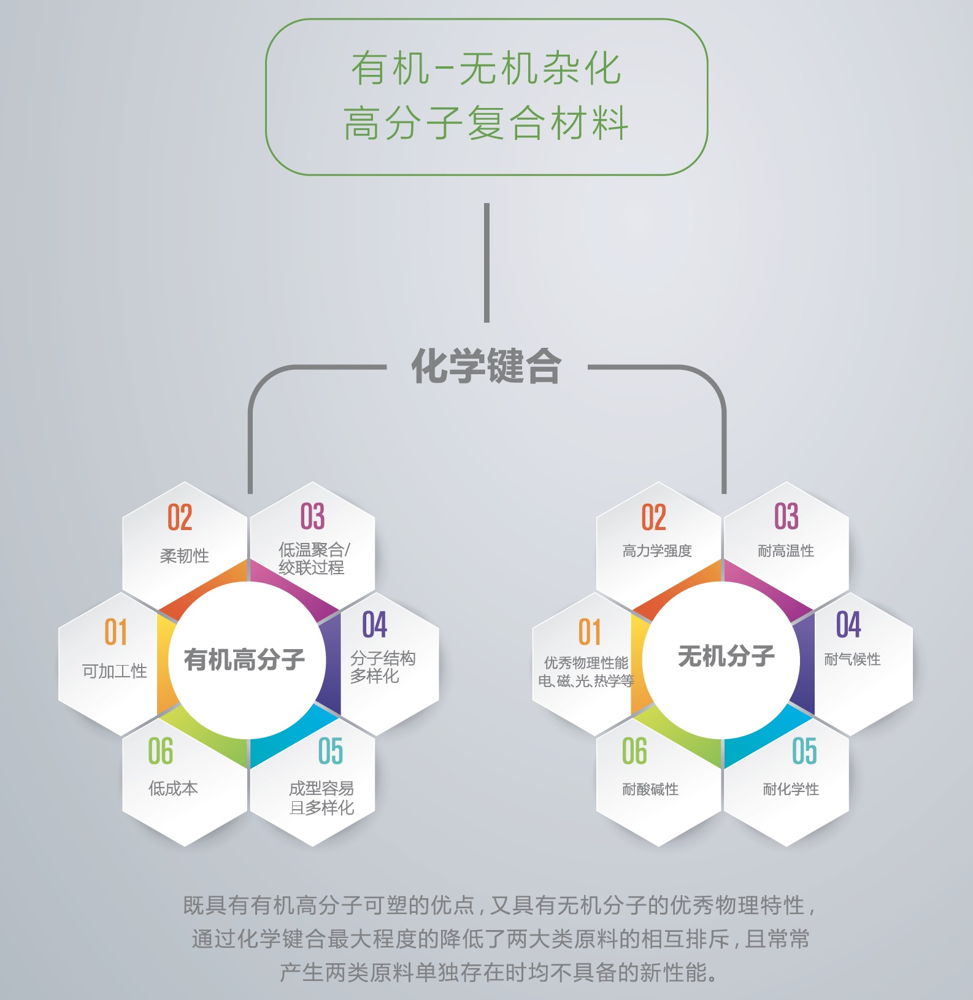

# 核心技术

有机-无机杂化高分子复合材料跨越了近20年来在材料学界受到广泛关注的纳米复合材料，在分子尺度上，从理论设计到实际工业大生产，成功地将无机分子的优秀物理性能和有机分子易于加工、易于制作以及卓越的柔韧特性，以化学键的方式巧妙的结合于一体。

同时，还最大程度地有效避免了原单独组分各自固有的缺点。有机-无机杂化高分子复合材料不仅在极大地程度上地克服了传统材料科学的一些固有矛盾：硬即可能脆，柔就可能弱，异相成分不匹配等等缺点，而且还有稳定性高，品质可控，材料的结构及性能可设计、可控制等优点，可实现工业化大规模生产及应用。

这种巧妙的杂化技术，还产生一些全新的，两种独立组分都不具有的性质，为我们开发各种新型材料开辟了一条崭新的道路。

该技术于2014年12月申请世界专利(PCT)，2016年05月获得美国专利局(US PTO)授权(发明专利号：US61723908)，2017年03月申请中国专利(申请号：201710183813.2)。

